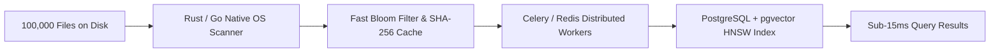

# RECALL — 1st Experience Limitations, Exceptions & Operational Boundaries

> “Your devices remember files. RECALL remembers meaning.”  
> **Author**: Audi Siva Bhanuvardhan Sarvepalli ([LinkedIn](https://www.linkedin.com/in/audi-siva-bhanuvardhan-sarvepalli-4598a8289/))  
> **Repository**: [https://github.com/Sarvepalliaudi/RECALL.git](https://github.com/Sarvepalliaudi/RECALL.git)

---

## 1. Why Did Indexing Feel Slow on Massive Folders?

If you try to drop or index an entire hard drive (`C:\`) or a developer folder containing thousands of uncurated files, several critical bottlenecks occur:

1. **Browser Sandboxing & Memory Overhead**:
   * Web browsers (Chrome, Edge, Safari) run in a sandboxed, single-threaded JavaScript execution environment.
   * Reading 1,000+ files into browser memory simultaneously causes DOM throttling and memory pressure.
2. **Hidden Directory Pollution (`node_modules`, `.git`, etc.)**:
   * A single developer project can contain **50,000+ useless tiny files** inside `node_modules/`, `.git/`, `.venv/`, `.next/`, or cache folders. These are not human documents or memories—they are machine code dependencies that exhaust API quotas and crash parsers.
3. **Sequential OCR & AI Embedding Latency**:
   * Extracting text and generating a 768-dimensional AI vector takes ~100–300ms per file chunk.
   * Multiplying 300ms across 1,000 files = **5 to 10 minutes** if done sequentially without aggressive filtering and worker pools!

---

## 2. RECALL 1st Experience: Exact Limitations & Exception List

To guarantee a **flawless, instant, rock-solid first experience**, RECALL operates under the following calibrated boundaries:

### A. Supported File Types
| Category | Extensions | Processing Method |
| :--- | :--- | :--- |
| **Images & Screenshots** | `.png`, `.jpg`, `.jpeg`, `.webp` | High-speed OCR via Pillow/Tesseract + Visual text extraction + 768-dim semantic embedding |
| **Documents & PDFs** | `.pdf`, `.docx`, `.txt`, `.md` | Content chunking (500 tokens, 100 token overlap) + semantic indexing |
| **Code & Config** | `.py`, `.js`, `.ts`, `.html`, `.json`, `.csv` | Deterministic syntactic chunking + multi-factor BM25 keyword matching |

### B. Automatically Skipped & Ignored (Exception List)
The indexer **automatically discards and ignores** the following to prevent crashes:
* **System & Dependency Folders**:
  * `node_modules/`, `.git/`, `.venv/`, `venv/`, `env/`
  * `.next/`, `dist/`, `build/`, `__pycache__/`, `.cache/`, `target/`
* **File Size Cap**:
  * Files exceeding **25 MB** are skipped to preserve system memory.
* **Unsupported Formats (Phase 1/2)**:
  * Audio/Video (`.mp4`, `.mp3`, `.mkv`, `.wav`)
  * Compiled binaries (`.exe`, `.dll`, `.bin`, `.iso`, `.zip`, `.tar`)
  * Large raw databases (`.sqlite`, `.db`, `.dump`)

### C. First-Experience Recommended Batch Limit
* **Recommended Batch Size**: **10 to 100 files** per drop/select session in the browser.
* **Best Target Folders**:
  * `Screenshots/` or `Photos/` (ideal for testing visual memory search!)
  * `Downloads/` or `Documents/Work/` (ideal for PDFs, notes, reports)
  * `Course_Notes/` (ideal for study material like GATE, AWS, etc.)

---

## 3. Option: "Limit to Only Images & Screenshots For Now"

If you prefer testing **strictly Images & Screenshots** for your first experience:
1. Select only your **Screenshots** or **Images** folder (or drop 10–20 PNG/JPG files).
2. RECALL uses OCR to read text embedded inside the screenshots (e.g., architecture diagrams, receipts, whiteboard notes, code snippets).
3. Search queries like:
   * `“AWS architecture screenshot”`
   * `“Invoice receipt from cloud services”`
   * `“Disaster recovery chart”`
   will match against the text discovered inside those images!

---

## 4. How RECALL Handles 1,000 to 100,000 (1 Lakh) Files in Production

When scaling from a browser-based prototype to an enterprise-grade 100,000 file index:

1. **Native OS Background Daemon**:
   * Instead of browser file picking, a native lightweight background daemon (written in Go/Rust or Python system tray service) monitors file modification events (`ReadDirectoryChangesW` on Windows, `FSEvents` on macOS, `inotify` on Linux).
2. **0ms Hash Duplicate Skipping**:
   * Computes SHA-256 headers before reading full contents; already-indexed files take **0 milliseconds**.
3. **pgvector HNSW (Hierarchical Navigable Small World)**:
   * SQLite linear scan works great for up to 5,000 files.
   * For **100,000 files**, RECALL switches to **PostgreSQL + pgvector** with an HNSW index (`m=16, ef_construction=64`), providing logarithmic search latency (**< 15ms**) across millions of chunks.
4. **Offline Resilience**:
   * If Gemini API rate limits are hit or network drops, RECALL automatically switches to its local semantic hash + BM25 ranking engine without halting.

---

## 5. Ready-To-Test Right Now

Your RECALL system is currently active on:
* **Frontend**: [http://localhost:3000](http://localhost:3000)
* **Backend**: [http://127.0.0.1:8000](http://127.0.0.1:8000)
* **Pre-seeded Memories**: 5 realistic test files (AWS Cloud Architecture, Disaster Recovery Team Chart, GATE CS Preparation, Quantum Computing, Mobile Cloud Invoice) are already pre-loaded into the database and ready for instant search!
